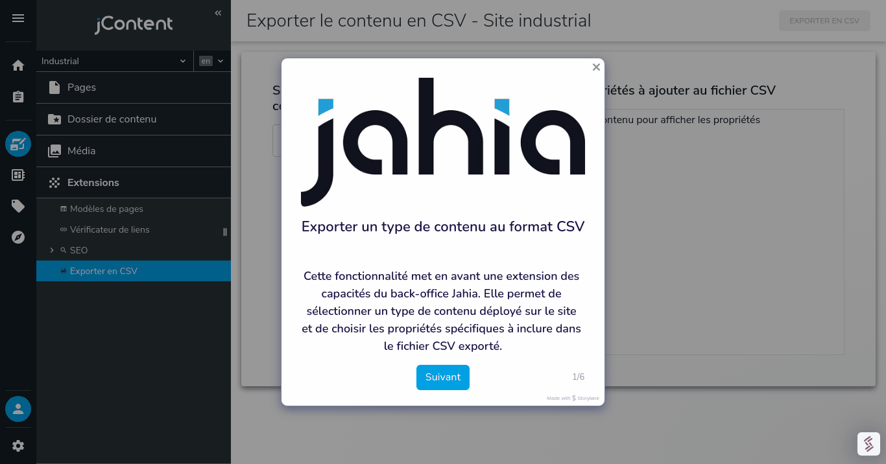

# Export Content to CSV Module

The **Export Content to CSV** module is a feature designed for Jahia's back-office. This module allows users to export content types and their selected properties into a CSV file.

---

## Features

- Add a new entry to the Jahia back-office menu after module deployment and activation.
- Select any deployed content type from a dropdown menu.
- View and select the properties associated with the selected content type.
- Export the selected properties of the chosen content type to a CSV file.
- CSV file includes:
    - Header with the selected properties.
    - Content data associated with those properties.

---

## Installation

1. **Build the Module**  
   Use Maven to build the module:
   ```bash
   mvn clean install

2. **Deploy the Module**

Deploy the generated .jar file to your Jahia server.

3. **Activate the Module**

Activate the module on the desired site.

---

## Usage

1. Open the Module

After deploying and activating the module, you will find a new entry in the Extensions menu of Jahia’s back-office.

2. Specify the CSV file separator

Enter the desired CSV separator

3. Select Content Type

From the dropdown menu, select the content type you want to export.

4. Select Properties

Choose the properties of the content type you want to include in the CSV export.

5. Export to CSV

Click the Export to CSV button to generate the CSV file. The generated file will include:
- A header with the selected properties.
- Content data corresponding to the selected properties.

---

## CSV Format

### Example Output

For the selected content type Article with properties title, description, and datePublished:
   ```bash
uuid,title,description,datePublished
123e4567-e89b-12d3-a456-426614174000,Sample Title,This is a sample description,2023-11-20
456e7890-e12b-34c4-d789-987654321000,Another Title,Another description,2023-11-21
   ```

---

## Technical Details

### GraphQL Queries

#### Fetch Content Types
   ```bash
query SiteContentTypesQuery($siteKey: String!, $language: String!) {
    jcr {
        nodeTypes(
            filter: {
                includeMixins: false, 
                siteKey: $siteKey, 
                includeTypes: ["jmix:droppableContent", "jnt:page", "jnt:file"], 
                excludeTypes: ["jmix:studioOnly", "jmix:hiddenType", "jnt:editableFile"]
            }
        ) {
            nodes {
                name
                displayName(language: $language)
            }
        }
    }
}
   ```
#### Fetch Properties for a Content Type
   ```bash
query GetContentPropertiesQuery($type: String!) {
  jcr {
    nodeTypes(filter: {includeTypes: [$type]}) {
      nodes {
        properties (fieldFilter: {filters: [{fieldName: "hidden", value: "false"}]}) {
          name
          hidden
        }
      }
    }
  }
}
   ```
#### Fetch Content for CSV
  ```bash
query getContentsByContentType($path: String!, $language: String!, $type: String!, $workspace: Workspace!, $properties: [String]) {
    jcr(workspace: $workspace) {
        result: nodeByPath(path: $path) {
            value: uuid
            label: displayName(language: $language)
            descendants(typesFilter: {types: [$type]}) {
                nodes {
                    value: uuid
                    label: displayName(language: $language)
                    properties(names: $properties, language: $language) {
                        name
                        value
                    }
                }
            }
        }
    }
}
   ```
---
## Contributions

Contributions are welcome! To contribute:
1.	Fork the repository.
2.	Create a new branch for your feature.
3.	Submit a pull request.

* [Github Repository](https://github.com/smonier/exportContentToCsv)


---
## License

This module is licensed under the MIT License.

---
## Screenshots


